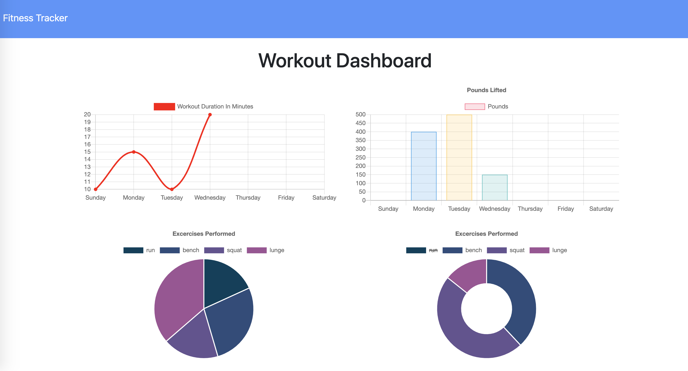

# Project Name: Fitness Tracker

## Author: grburner

  

## Table of Contents
<!--ts-->
1. [ Project Description ](#desc)
2. [ Installation Instructions ](#inst)
3. [ Usage Information ](#use)
4. [ Contribution Guidelines ](#guide)
5. [ Test Instructions ](#test)
6. [ License Type ](#l-type)
7. [ Questions | Email me ](#email)

<!--te-->

## 1. Project Description

A fitness tracker to log workouts, track progress and visualize data.

## 2. Installation Instructions

 run npm i to install

## 3. Usage Information

 Easily track workouts by clicking the "New Workout" button. Use "Add Exercise" to add an exercise to a workout. 

## 4. Contribution Guidelines

 Open a pull request to contribute!

## 5. Test Instructions

 npm test

## 6. License Type

 Licensed under the [MIT](license/mit.txt) license.

## 7. Questions? Email me @:

[grburner@gmail.com](mailto:grburner@gmail.com) or find me on [GitHub](https://github.com/grburner)